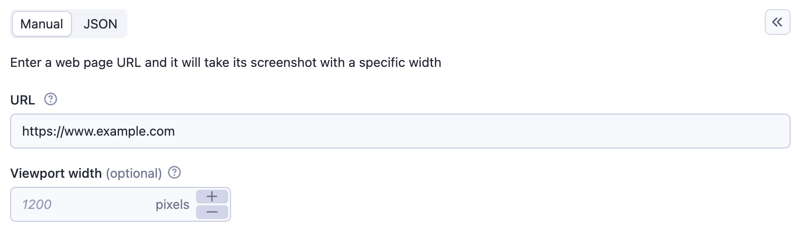

Each Actor accepts an **input object**, which tells it what it should do. The object is passed in JSON format, and its
properties have a similar role as command-line arguments when running a program in a UNIX-like operating system.

For example, an input object for an Actor `bob/screenshot-taker` can look like this:

```json
{
  "url": "https://www.example.com",
  "width": 800
}
```

The input object represents a standardized way for the caller to control the Actor's activity, whether starting it using
API, in user interface, CLI, or scheduler. The Actor can access the value of the input object using the Get input
function.

In order to specify what kind of input object an Actor expects, the Actor developer can define an Input schema file.

The input schema is used by the system to generate user interface, API examples, and simplify integrations with external
systems.

## Example of auto-generated Actor input UI


