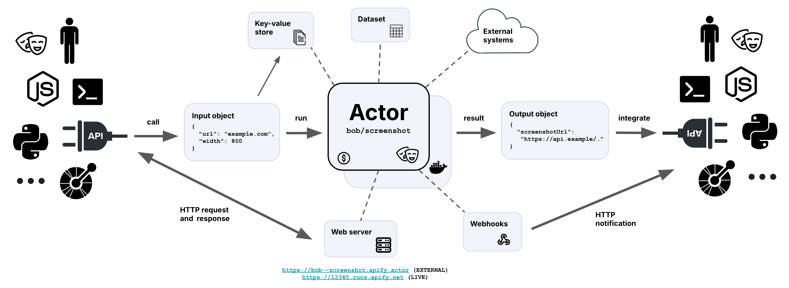

Actors are serverless programs running in the cloud. They can perform anything from simple actions such as filling out a
web form or sending an email, to complex operations such as crawling an entire website, or removing duplicates from a
large dataset. Actors can persist their state and be restarted, and thus they can run as short or as long as necessary,
from seconds to hours, even infinitely.

Basically, Actors are programs packaged as Docker images, which accept a well-defined JSON input, perform an action, and
optionally produce a well-defined JSON output.

Actors have the following elements:

- **Dockerfile** which specifies where is the Actor's source code, how to build it, and run it.
- **Documentation** in a form of README.md file.
- **Input and output schemas** that describe what input the Actor requires, and what results it produces.
- Access to an out-of-box **storage system** for Actor data, results, and files.
- **Metadata** such as the Actor name, description, author, and version.

The documentation and the input/output schemas make it possible for people to easily understand what the Actor does,
enter the required inputs both in user interface or API, and integrate the results of the Actor into their other
workflows. Actors can easily call and interact with each other, enabling building more complex systems on top of simple
ones.

<!-- Image source: https://docs.google.com/presentation/d/1nDgrI0p2r8ouP_t_Wn02aTllP8_Std-kRuIbO8QLE7M/edit -->
